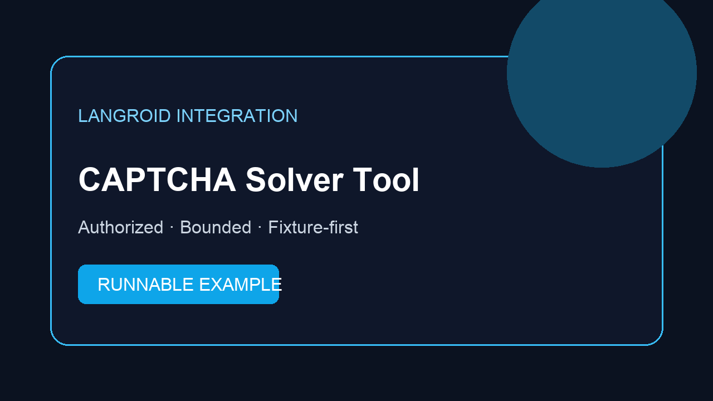

# How to Add a CAPTCHA Solver MCP Tool to Langroid

## Introduction

[English](README.md) · [简体中文](docs/zh-CN/README.md) · [日本語](docs/ja/README.md) · [Español](docs/es/README.md) · [Português](docs/pt-BR/README.md) · [한국어](docs/ko/README.md)

[Langroid](https://github.com/langroid/langroid) agents can call tools during an authorized workflow. When a Langroid agent reaches a CAPTCHA while running an authorized browser or data task, the workflow needs a clear checkpoint instead of an uncontrolled retry loop. This repository shows how to connect a bounded solver tool, validate its result, and stop for human review when the request is unsafe or incomplete. The example naturally connects [CapSolver](https://www.capsolver.com/?utm_source=github&utm_medium=referral&utm_campaign=langroid-captcha-solver-mcp-tool&utm_content=repository-readme) only after explicit authorization.

## What this repository demonstrates

- a verified `MCP ToolMessage adapter` integration boundary;
- typed challenge input and structured output;
- one-attempt budget, 45-second default timeout, and result validation;
- fixture-first tests with no real key, target, or solver request;
- a manual-review result for denied, unsupported, exhausted, or malformed requests.

## Quick start

```bash
python -m venv .venv
source .venv/bin/activate
pip install -e . pytest
pytest -q
python scripts/smoke.py
```

## Minimal call

```python
from captcha_solver_tool import solve_checkpoint

result = solve_checkpoint({
    "task_id": "authorized-qa-42",
    "origin": "https://example.test",
    "challenge_type": "recaptcha_v2",
    "authorized": True,
})
print(result["status"])
```

See [`src/captcha_solver_tool/adapter.py`](src/captcha_solver_tool/adapter.py) for the Langroid boundary. Production code should implement a transport using the official [CapSolver API overview](https://docs.capsolver.com/en/guide/what-is-capsolver/), [createTask](https://docs.capsolver.com/en/guide/api-createtask/), and [getTaskResult](https://docs.capsolver.com/en/guide/api-gettaskresult/) contracts.

## Control flow

1. Detect a supported verification checkpoint.
2. Confirm the target and purpose are authorized.
3. Spend at most one solving attempt.
4. Validate a ready result before continuing.
5. Stop for a person on any error, timeout, denial, or ambiguity.

## Responsible use

Use this example only with public data, systems you own, or targets where you have explicit permission. Respect site terms, rate limits, privacy obligations, and data-retention rules. Do not use it for account creation at scale, access controls, private data, credential collection, or avoiding platform safeguards.

## Project status

The adapter contract and offline behavior are tested. No live Langroid model session and no real CapSolver request are performed by the test suite. This is an independent educational example and does not imply an official partnership.

## Conclusion

The example keeps authorization, attempt budgets, result validation, and human stopping explicit. Use the official [CapSolver](https://www.capsolver.com/?utm_source=github&utm_medium=referral&utm_campaign=langroid-captcha-solver-mcp-tool&utm_content=repository-readme) documentation when replacing the fixture transport.

## Disclosure

Developer sharing CapSolver integration examples.

## License

MIT. See [`LICENSE`](LICENSE).
